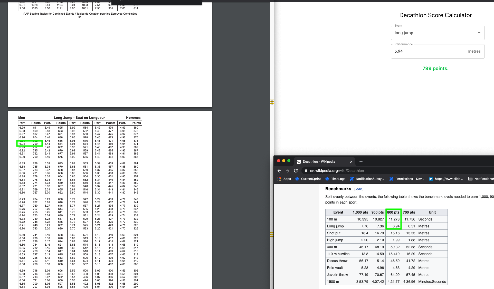

## Attributions
* Front-end spun up with [Create React App](https://github.com/facebook/create-react-app);
* Front-end uses [Material UI](https://material-ui.com);
* API boilerplate generated with [Spring Initializr](https://start.spring.io).

## Starting the Application
1. Ensure docker is installed;
2. Navigate to project root;
3. Run `docker-compose up`;
4. Access the UI via [http://localhost:3001](http://localhost:3001).

## Notes
Please use [the official IAAF scoring tables](http://www.iaaf.org/download/download?filename=53f7d332-be0c-434c-8467-1d9078966147.pdf&urlslug=IAAF%20Scoring%20Tables%20for%20Combined%20Events) to evaluate accuracy.

Wikipedia's benchmark values do not always match the values present in the scoring tables:

